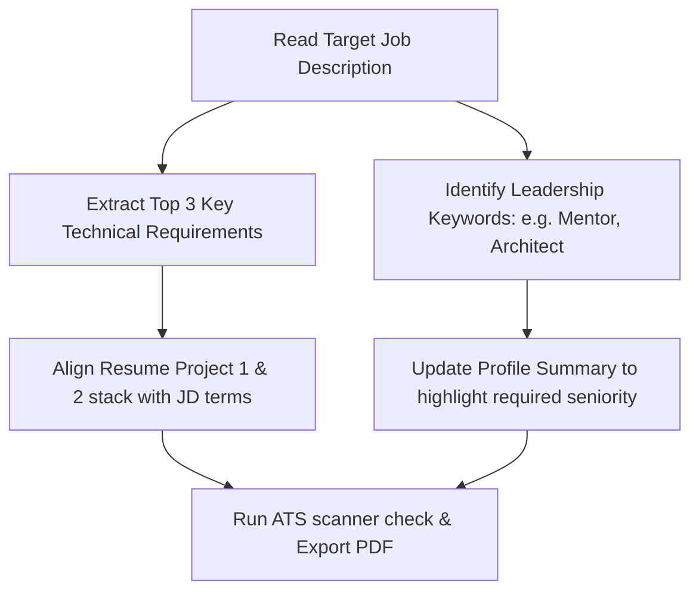

# Resume Rules & ATS Optimisation

This guide outlines the core rules used to build and tailor your resume for Principal/Staff/Lead roles. It ensures your resume survives both the automated applicant tracking system (ATS) filters and the fast-paced recruiter screening.

[← Back to Index](../README.md)

---

## ⏱️ The 6-Second Screen Rule

Recruiters spend an average of 6 seconds on the first read of a resume. To capture their attention immediately:
1. **F-Shape Reading Layout:** Put the most important information (Title, Key Technologies, and Metrics) on the top-left of each experience section.
2. **Bold Key Terms:** Highlight key tech stack keywords (e.g., **LiteLLM, LangChain, GKE, Kubernetes, Kafka, GCP**) so they jump out during a quick scan.
3. **Leading Action Verbs:** Start every single bullet point with a strong action verb (e.g., *Architected, Spearheaded, Designed, Optimised, Debugged*). Never say "Responsible for..." or "Helped with...".

---

## 🤖 ATS Optimisation Rules

Top product companies use applicant tracking systems (e.g., Greenhouse, Workday, Lever) to filter candidates before a human ever sees the application.

1. **Format Rules:**
   - **File Type:** Always upload a clean, text-based PDF. Do not use image PDFs or scanned copies.
   - **Layout:** Use a single-column layout. Multi-column tables often confuse parser engines, scrambling your work history out of chronological order.
   - **Fonts:** Stick to standard system fonts (Arial, Helvetica, Calibri, or Georgia). Avoid custom icon fonts.
   - **Headers:** Keep section headings standard: `Professional Experience`, `Technical Stack`, `Projects`, `Education`. Do not write creative names like `Where I've Been`.

2. **Keyword Matching Strategy:**
   - Always map the key programming languages and infrastructure tools from the job description directly into your resume's technical stack.
   - For Staff/Principal positions, ensure words like **Scale, System Design, Architecture, Mentoring, Code Reviews,** and **Cross-functional** are sprinkled naturally.

---

## 📈 Impact Framing (The X-Y-Z Formula)

Every experience bullet point must show what you did, how you did it, and the quantitative business outcome. We use Google’s **X-Y-Z Formula**:
> **"Accomplished [X], as measured by [Y], by doing [Z]."**

### ❌ Weak Bullet (v1):
> "I added rate limiting to the LiteLLM gateway."

###  Strong Bullet (X-Y-Z Format):
> "Protected internal model endpoints against resource abuse (**X**), reducing vendor API overages by **40%** (**Y**), by implementing per-team rate-limiting algorithms and Redis token counters in our LiteLLM gateway (**Z**)."

### Examples tailored to your history:

* **Saga Pattern at ConnectWise:**
  - *Accomplished:* Handled distributed transaction failures in documentation ingestion.
  - *Impact:* Eliminated partial failures and achieved **100%** data consistency.
  - *Action:* Designed and built the Saga Orchestration pattern across 3 microservices in Node.js.
  - *Resulting Bullet:* "Eliminated partial database state write failures (**X**), achieving **100%** transaction consistency across 3 microservices (**Y**), by designing and implementing a Node.js Saga Orchestrator (**Z**)."

* **Master-Worker pattern at ConnectWise:**
  - *Accomplished:* Resolved ITBoost stabilization lag.
  - *Impact:* Improved file ingestion speed by **35%** and eliminated database deadlocks.
  - *Action:* Refactored document indexing workloads to a Master-Worker Node.js pattern.
  - *Resulting Bullet:* "Accelerated large document indexing by **35%** and eliminated concurrency deadlocks (**X**) for ITBoost (**Y**), by refactoring asynchronous workloads into a decoupled Master-Worker execution pattern (**Z**)."

---

## 🛠️ Step-by-Step JD Tailoring Blueprint

When you apply to a high-priority role, spend 10 minutes adjusting your resume:

1. **First Pass (Tech Stack):** If the JD asks for "Vertex AI, Node.js, GCP", make sure those are in the top line of your resume summary and work description.
2. **Second Pass (Scale & Team):** If the JD is for a "Staff Engineer" focusing on mentoring, change "Built AI Gateway" to "Architected AI Gateway and mentored 5 junior engineers through production delivery".
3. **Metric Alignment:** Ensure the metrics you call out match the division's goals (e.g., if it's a fintech team, lead with performance/security metrics; if it's an AI team, lead with model costs/routing speeds/latency).
