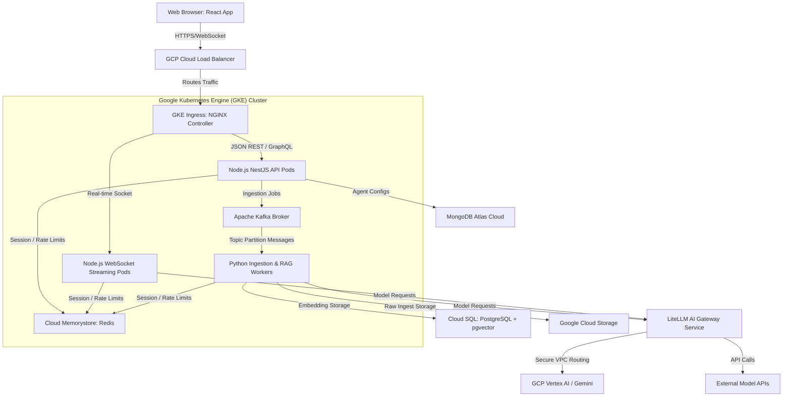

# System Design — GCP Full-Stack AI Platform

This document describes the production system design of the **No-Code AI Agent Builder Platform** built on GCP, mapping out how the components fit together to serve clients securely and at scale.

[← Back to Index](../README.md) | [← Previous: Tell Me About Yourself](./Tell_Me_About_Yourself.md) | [Next: AI Gateway Deep Dive](./AI_Gateway_Deep_Dive.md)

---

## 🏗️ Architecture Diagram

---

## ⚙️ Component Breakdown & Scale Decisions

### 1. Ingress & Traffic Management
* **Technology:** GCP Cloud Load Balancer (GCLB) → NGINX Ingress Controller.
* **Why:** GCLB handles SSL termination at the edge. NGINX handles routing rules inside the Kubernetes cluster. We isolate HTTP REST/GraphQL APIs from WebSocket traffic, forwarding socket requests to dedicated WebSocket pods with long timeouts.

### 2. Node.js NestJS API Pods (Backend)
* **Role:** Multi-tenant account management, project metadata, agent configuration schemas, and client workspaces.
* **Data Storage:** MongoDB Atlas (replicated). Document structures allow enterprise clients to save dynamic agent nodes (e.g., node position, tool bindings, properties) in a single document without complex SQL migrations.
* **Authentication:** Workload Identity Federation on GKE allows pods to securely write directly to GCP buckets and Secrets without local Service Account JSON keys stored in environment variables.

### 3. Asynchronous Worker Ingestion (Event-driven Layer)
* **Technology:** Apache Kafka + Python/LangChain Workers.
* **Why:** Ingestion of large enterprise files (PDFs, docs) cannot run on the main event loop. Node.js backend pushes ingestion tasks (e.g., `{"file_url": "gs://...", "tenant_id": "123"}`) to Kafka.
* **Python Workers:** Worker pods consume from Kafka topics, partition files, execute semantic chunking, call Vertex AI embedding models, and store vectors in **Cloud SQL PostgreSQL (with `pgvector` extension)**.

### 4. WebSocket Streaming Layer (Real-time Feedback)
* **Role:** Enables interactive token-by-token text generation.
* **Pattern:** The client initiates a WebSocket connection to `ws-service`. When a user prompts an agent:
  1. WebSocket service forwards the agent invocation to the LLM Gateway.
  2. The gateway streams the model chunk back using standard Server-Sent Events (SSE).
  3. The WebSocket service intercepts the SSE stream and pushes the chunks in real-time to the client socket.

---

## ⚡ Scale & Reliability Patterns Used

### 1. Zero-Downtime Deployment
* Deployment configurations use Kubernetes rolling updates with configured `readinessProbe` and `livenessProbe`. This ensures that traffic is not routed to starting NestJS/Node instances until they have completed MongoDB/Redis handshake checks.

### 2. Microservice Fault Isolation (Circuit Breakers)
* Built-in circuit breakers protect downstream internal systems. If the PDF Parser worker crashes, Kafka partitions buffer incoming ingestion events, ensuring the main NestJS API remains fully operational so users can still build and configure agents.

### 3. Scaling Policies (Horizontal Pod Autoscaling - HPA)
* **API Service:** Scaled based on average **CPU utilisation** (> 70%).
* **WebSocket Service:** Scaled based on **Active Socket Connections** (max 5,000 per pod).
* **Ingestion Workers:** Scaled based on **Kafka consumer lag queue depth** (using KEDA Kubernetes Event-driven Autoscaling).
